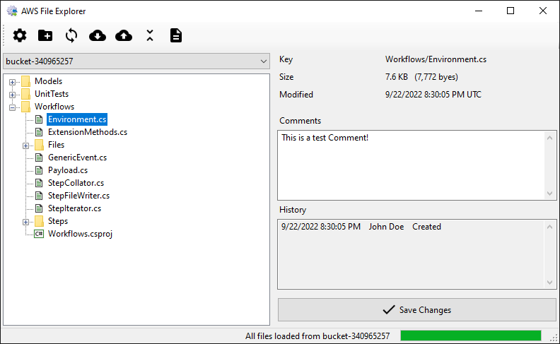
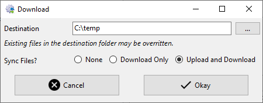
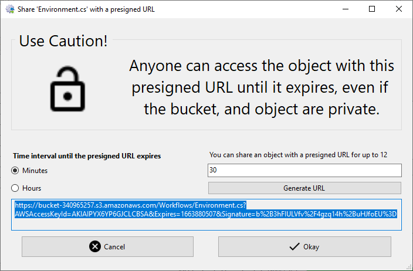
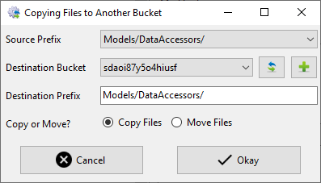

# AwsExplorer
 
 

AwsExplorer allows a user to manage files located in a remote AWS S3 bucket, upload new files to the bucket, download existing files from the bucket, and sync files in both locations. With AwsExplorer, you can:

- Upload files or folders to S3
- Download files from S3 to your computer
- Generate a signed URL to share files even if they are not public
- Keep files on your computer and in S3 synced up
- Copy/Move files between buckets
- Copy/Move files between accounts
- Optionally, track updates to files in S3
- Optionally, associate comments to each file

Planned features:

- Ability to query a delimited file (CSV, JSON, Parquet)
- Ability to change file version in versioned buckets
- Additional options when creating a bucket
- Options to lock a file (legal hold or retention period)
- Ability to manage tags on files
- Ability to make files public/private

## Upload files or folders to S3

Uploading files or folders to S3 using AwsExplorer is as easy as dragging them onto the TreeView component on the left-hand side of the window. If you elected to track changes and comments on files, an entry will be created listing who and when uploaded the file.

## Download files from S3 to your computer

You can download a file or a folder to your local computer by right-clicking on it in the TreeView on the left-hand side of the window and choosing 'Download' from the context menu. On the dialog that appears, you can choose where you want the file or folder to be downloaded to your computer and whether or not to keep the files in sync. There are three options for syncing files:

- None: No file sync will occur. You are only downloading files from S3.
- Download: This keeps the files you have downloaded in sync with any changes in the files in S3. Any local changes you make will not be transfered to S3.
- Download and Upload: This option keeps the files on your computer and the files in S3 in sync.

## Generate a signed URL to share files even if they are not public

By default, all files in an S3 bucket are private. However, you can share these files by generating a signed URL and distrubing the URL. The URL will time out after a pre-determined amount of time.

## Copy/Move files between buckets

With AWS Explorer, you can easily move files or a subset of files between buckets.
